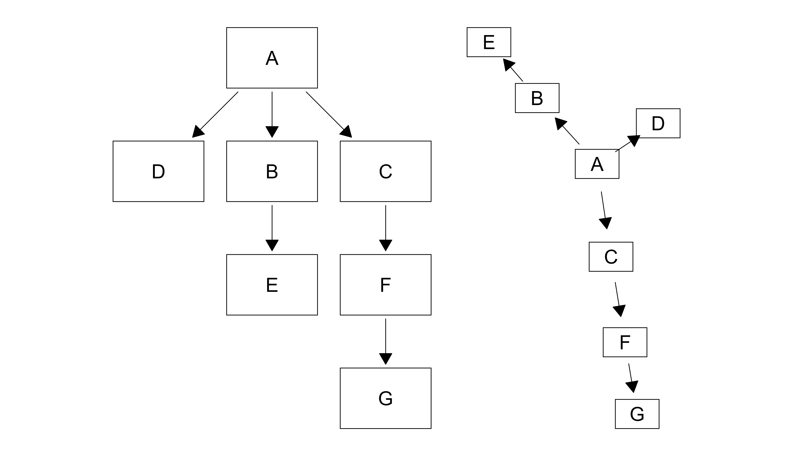
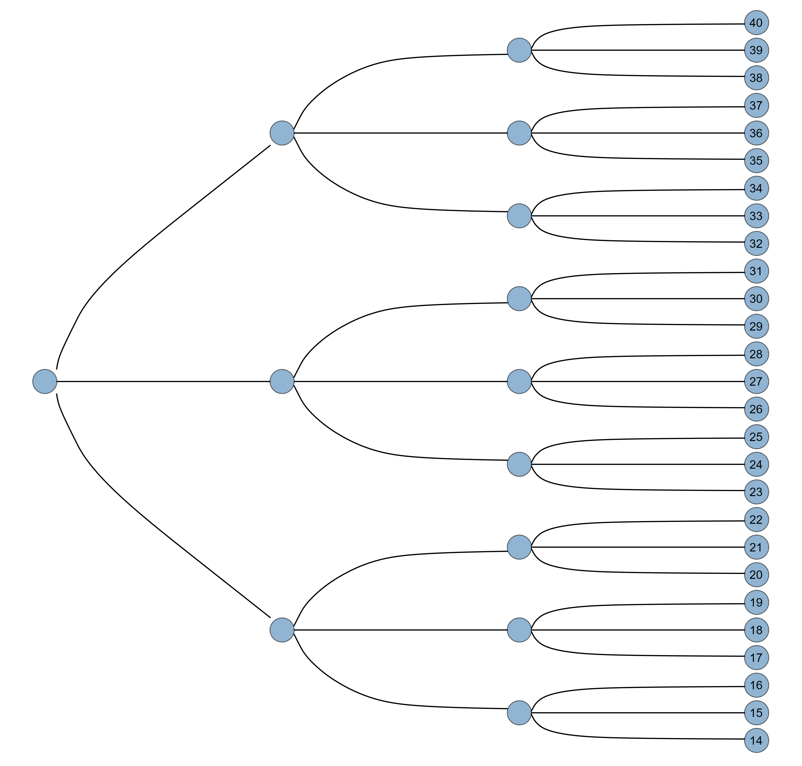
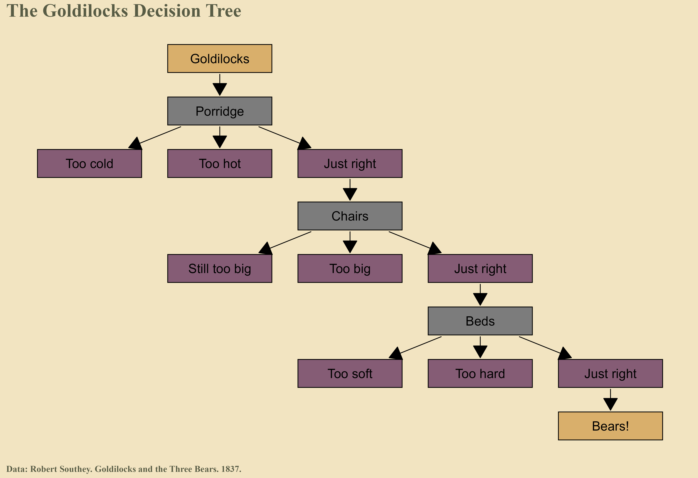
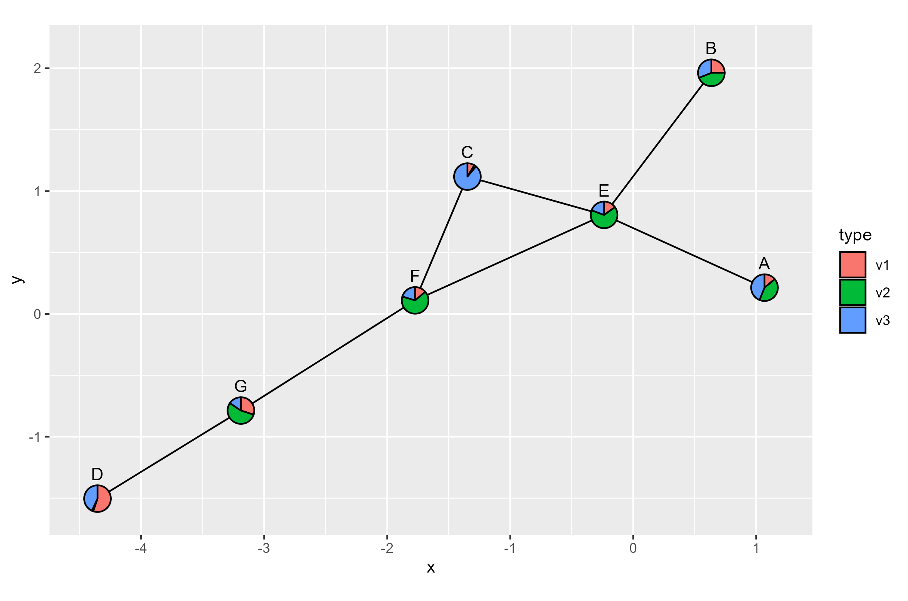

# ggflow: Draw Flow Chart based on 'ggtree'


## Simple Example

```r
# Example from <https://nrennie.rbind.io/ggflowchart/>

library(ggflow)

d <- data.frame(
  from = c("A", "A", "A", "B", "C", "F"),
  to = c("B", "C", "D", "E", "F", "G")
)

p1 <- ggflow(d, arrow=arrow(type='closed')) + 
    geom_scatter_rect(fill=NA, color='black') +
    geom_text(aes(label=label), size=10)

p2 <- ggflow(d, arrow=arrow(type='closed'), layout=igraph::layout_nicely) + 
    geom_scatter_rect(fill=NA, color='black') +
    geom_text(aes(label=label), size=10) 

aplot::plot_list(p1, p2)
```    




## ggtree layout

```r
library(igraph)
library(ggflow)

g <- graph.tree(40, 3)

ggflow(g, layout = "ellipse", start_shave=0.05, end_shave=0.05) +
  geom_point(size=10, shape=21, fill='steelblue', alpha=.6) + 
  geom_tiplab(hjust=.8, vjust=.5) 
```




## Decision Tree


```r
# Example from <https://nrennie.rbind.io/ggflowchart/>

goldilocks <- data.frame(
  from = c(
    "Goldilocks",
    "Porridge", "Porridge", "Porridge",
    "Just right",
    "Chairs", "Chairs", "Chairs",
    "Just right2",
    "Beds", "Beds", "Beds",
    "Just right3"
  ),
  to = c(
    "Porridge",
    "Too cold", "Too hot", "Just right",
    "Chairs",
    "Still too big", "Too big", "Just right2",
    "Beds",
    "Too soft", "Too hard", "Just right3",
    "Bears!"
  )
)

node_data <- data.frame(
  label = unique(unlist(goldilocks))
)

node_data$name <- gsub("\\d+$", "", node_data$label)

node_data$type = c(
      "Character", "Question", "Answer",
      "Question", "Answer", "Question",
      "Answer", "Answer", "Answer",
      "Answer", "Answer", "Answer",
      "Answer", "Character"
  )


library(treeio)
library(ggtree)
library(ggplot2)
library(ggflow)

tr <- as.phylo(goldilocks)
td <- full_join(tr, data.frame(node_data))


ggflow(td, arrow = arrow(type='closed')) + 
    geom_scatter_rect(aes(fill=type), color='black') +    
    geom_text(aes(label=name), size=6) +
    labs(title = "The Goldilocks Decision Tree",
        caption = "Data: Robert Southey. Goldilocks and the Three Bears. 1837.") +
    theme_tree(plot.title = element_text(size=25, family="serif", face='bold', colour = "#585c45"),
        plot.caption = element_text(size=12, family="serif", face='bold', colour = "#585c45", hjust=0),
        legend.position = "none",
        plot.background = element_rect(colour = "#f2e4c1", fill = "#f2e4c1"),
        bgcolor = "#f2e4c1"
    ) +
    rcartocolor::scale_fill_carto_d(palette = "Antique")
```



## ggtree-style network visualization

```
flow_info <- data.frame(from = LETTERS[c(1,2,3,3,4,5,6)],
                        to = LETTERS[c(5,5,5,6,7,6,7)])

dd <- data.frame(
    label = LETTERS[1:7],
    v1 = abs(rnorm(7)),
    v2 = abs(rnorm(7)),
    v3 = abs(rnorm(7))
)

g = igraph::graph_from_data_frame(flow_info)

p <- ggplot(g)  + geom_edge()
library(ggplot2)
library(scatterpie)

p %<+% dd + 
    geom_scatterpie(cols = c("v1", "v2", "v3")) +
    geom_text(aes(label=label), nudge_y = .2) + 
    coord_fixed()
```



